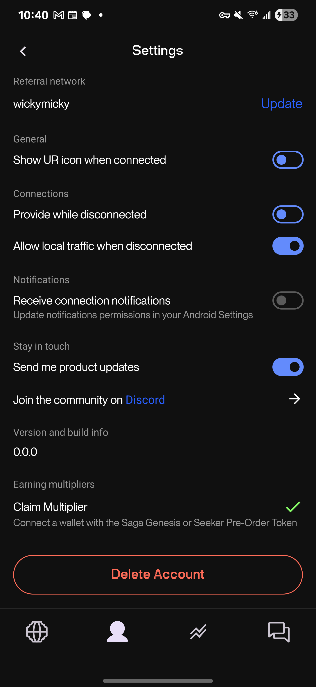
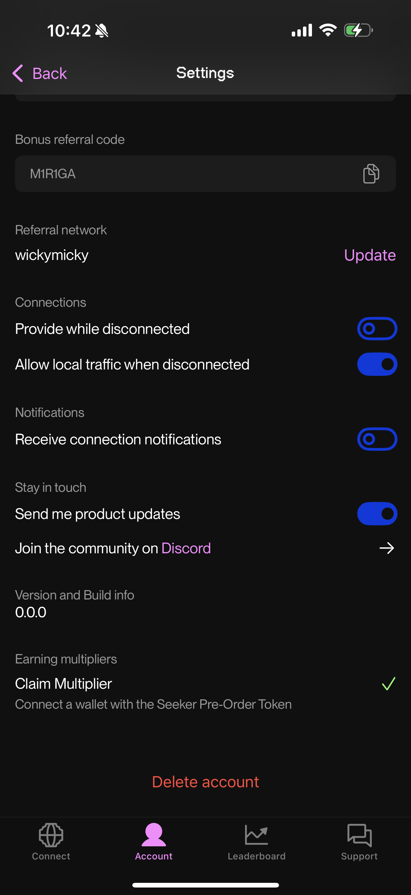

# How to Delete your Account

Under the Account -> Settings section, find the Delete Account button. Tap the button and confirm. Your network and associated information will be irrevocably and permanently deleted from the platform.

### Android screenshot

### iOS screenshot

